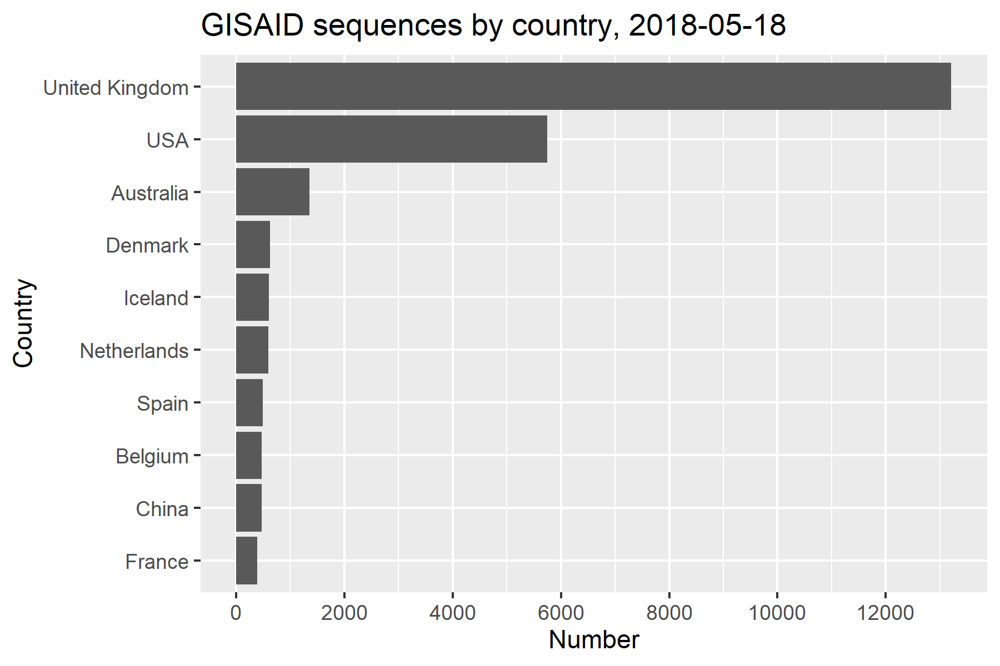
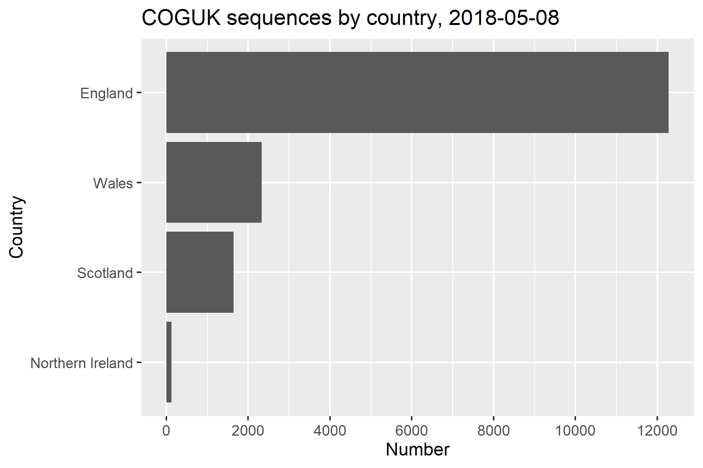
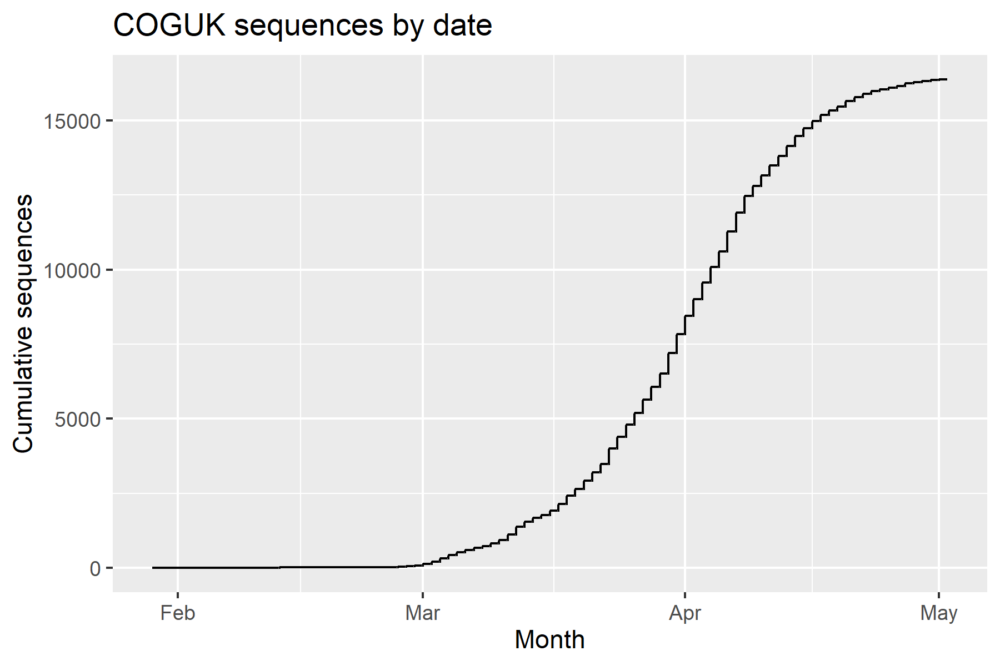
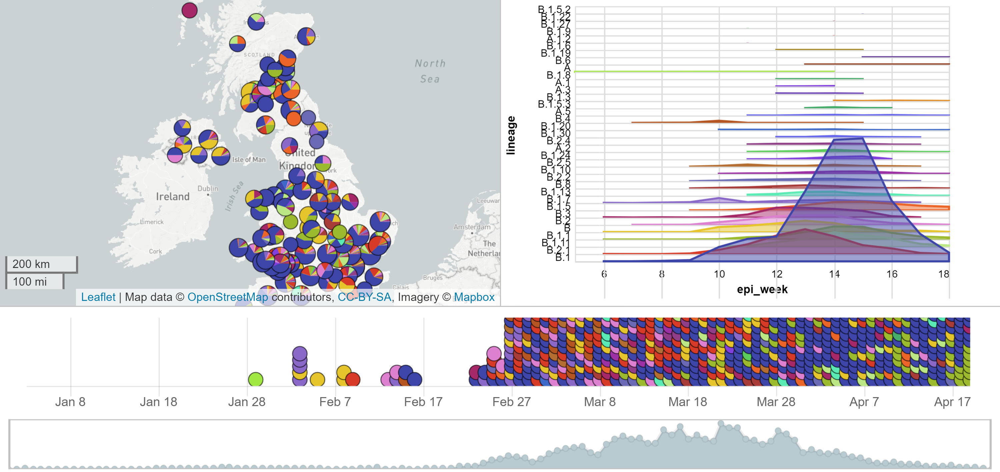
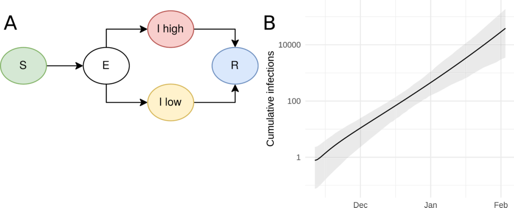
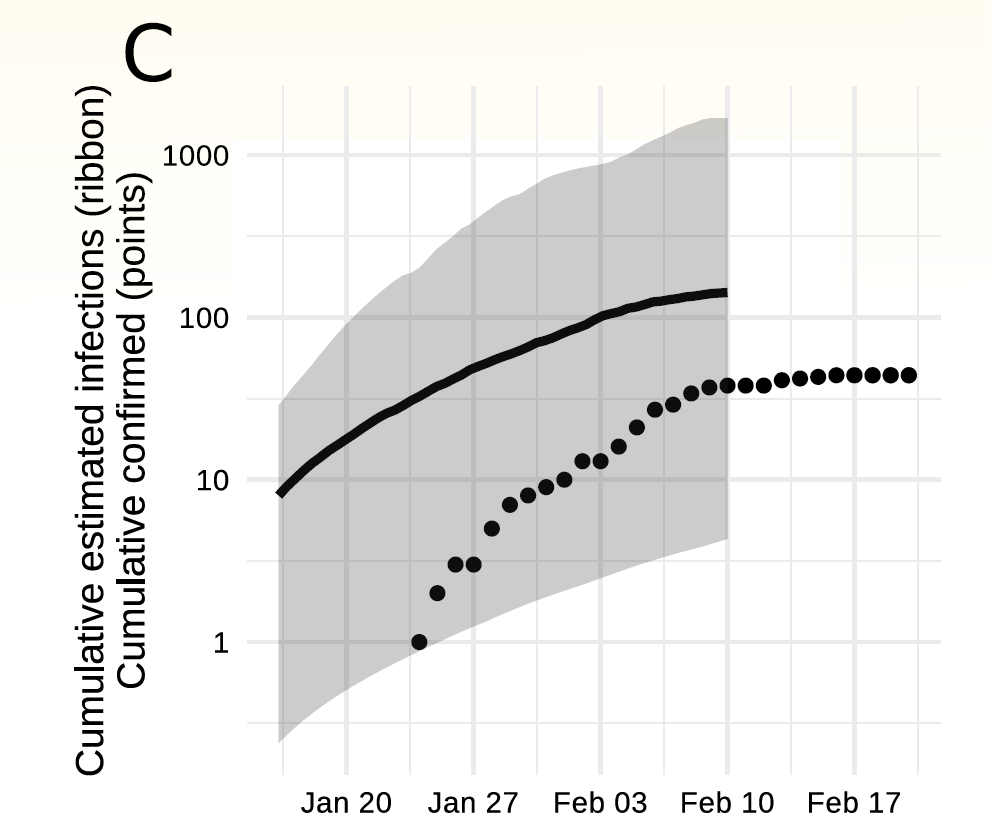
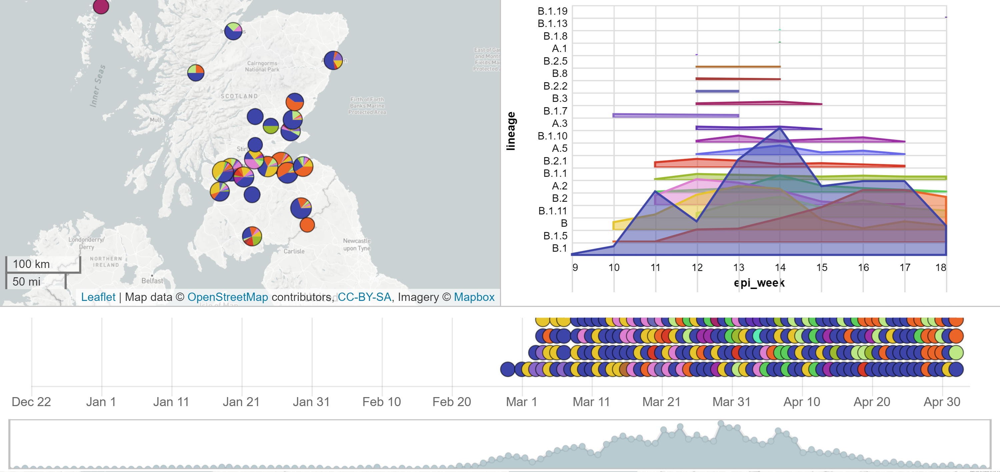
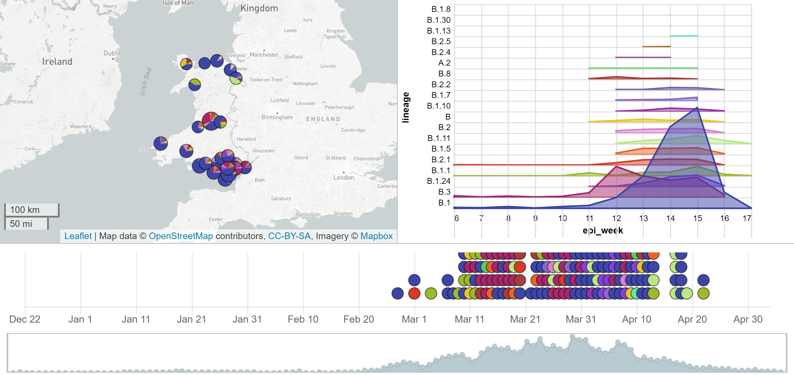
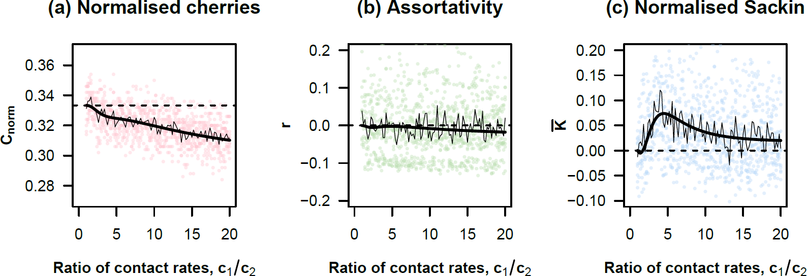

---
title:
output:
  revealjs::revealjs_presentation:
    theme: simple
    css: styles.css
    self_contained: false
    transition: none
    mathjax: local
    #reveal_plugins: ["zoom","chalkboard"]
always_allow_html: yes
---

```{r setup, include=FALSE}
knitr::opts_chunk$set(echo = FALSE)
knitr::opts_chunk$set(fig.align='center')
knitr::opts_chunk$set(fig.width=7)
knitr::opts_chunk$set(fig.height=5)
knitr::opts_chunk$set(out.extra='border:0px;')
suppressPackageStartupMessages(library(ggplot2))
```

## {data-background=#d3d3d3}

<h2 style="color:#0047AB">Phylodynamics of SARS-CoV-2</h2>
<h2 style="color:#000000">Simon Frost</h2>
<h3 style="color:#000000">Principal Data Scientist, Microsoft Health Futures</h3>
<h3 style="color:#000000">Professor of Pathogen Dynamics, LSHTM</h3>
<br>


## Models old and new

- Old
  - SIR/SEIR
- Not as old
  - Stochastic models
  - Age structured models
- Recent
  - Agent-based models
  - Network models
- New
  - Phylodynamic models

## Phylodynamics

- Models that *integrate* evolutionary models with...
  - Epidemiology
  - Immunology
  - Ecology
- Different data streams can complement and enhance each other
- Villabona-Arenas, Hanage and Tully (2020) argue that phylogenetic data *should* be integrated with other sources

## Sequence data

- Why include sequence data?
  - Introduction of cases
  - Spatial coupling
  - Hidden heterogeneity
- Remarkable generation *and dissemination* of SARS-CoV-2 sequence data
  - GISAID: collates data worldwide
  - COGUK: COVID-19 Genomics UK Consortium 

##

{width="90%"}


##

{width="90%"}

##

{width="90%"}


## Increased accessibility

- Not just ability to download sequences
- Post-processed data
  - Alignment
  - Lineages
- Dashboards
  - Nextstrain, Microreact, CoV-GLUE

## Microreact: UK data

{width="90%"}

## Yet studies are limited

- medrXiv/biorXiv:
  - 'SEIR and COVID19': 445 hits
  - 'phylodynamics and COVID19': 26 hits
- Until recently, sample sizes of studies were small
- Typically stronger on the phylogenetics than on the modeling

## Early dynamics (n=53)

- SEI(2)R model with (assumed) heterogeneity in infectiousness
- $R_0=2.15$ $(1.79-2.75)$

{width="80%"}
<small>Volz et al., Imperial Report 5, 2020-02-15</small>

## Weifang outbreak (n=20)

{width="55%"}

<small>Volz et al., medrXiv, 2020-03-19</small>

## Li and Ayscue: multiple locations (n=1,113)

- Joint estimation using cases and phylogeny
  - Methodology of Li, Grassly, and Fraser, assuming a branching process with time-varying parameters
- Estimated undercount of cases as well as heterogeneity in cases

{width="90%"}

<small>Li and Ayscue, medrXiv, 2020-05-09</small>

## Australian epidemic (n=903)

- Assume two regimes of $R$ and fitted timing and magnitude using a birth-death process

{width="60%"}

<small>Seemann et al., medrXiv, 2020-05-16</small>

## Problems

- With few exceptions, studies that use SARS-CoV-2 sequence data are more 'phylo' and less 'dynamics'
- Datasets are large and expanding rapidly
  - Allows us to fit more complex models...
  - Computationally expensive

## Solutions?

- Long term:
  - Focus on scalable inference
- Short term:
  1. Look at smaller e.g. subnational epidemics
  2. Generate predicted phylogenies from existing models

## 1. Smaller epidemics

- Analyses of datasets in the low 1000s is possible with current frameworks
  - Scotland
  - Wales

## Microreact: Scotland data

{width="90%"}

## Microreact: Wales data

{width="90%"}

## 2. Generating predicted phylogenies

- Algorithms and tools exist *today* to take epidemiological models and output phylogenies
  - ODE models: phydynR (Volz)
  - Gillespie-type models: MASTER (Vaughan)
  - Agent-based models:
    - VirusTreeSimulator (Hall)
    - treesampler (Kosakovsky Pond)
- A requirement is that we need to understand the link between state changes in an epidemiological model and the phylogeny

## An analogy: deterministic vs. stochastic models

- Consider a birth-death process with birth rate $b$ and death rate $d$
- In a deterministic ODE model, we just have to consider the difference in rates $b-d$
- In a stochastic model, we have to consider both processes

## Phylodynamic vs. non-phylodynamic models

- By defining models in terms of their components, we can easily extend epidemiological models to generate phylogenies
  - Transmission results in lineages splitting
  - Processes such as movement can result in a change in lineage state
- With more work, it is possible to extend them to generate summary statistics of phylogenies
  - Clustering, asymmetry etc.
  - Frost and Volz (2010,2013)

## Core groups and phylogeny

{width="90%"}
<small>Frost and Volz (2013)</small>

## Deterministic models with phydynR

```
births <-  c('parms$beta*S*I')
deaths <- c('(parms$mu+parms$gamma)*I')
names(births) <- names(deaths) <- c("I")
nonDemeDynamics <- c('parms$mu*(S+I+R)-parms$beta*S*I-parms$mu*S',
                     'parms$gamma*I-parms$mu*R')
names(nonDemeDynamics) <- c("S","R")
```

## Dynamics and trees

{width="90%"}

## Stochastic models with MASTER

```
<reaction spec='Reaction' reactionName="Infection" rate="0.005">
	S + I -> 2I
</reaction>
<lineageSeed spec='Individual' population='@I'/>
```

## Agent based models

- Perhaps the simplest to deal with
- Just need to keep track of
  - who infected whom (and when)
  - when infected cases die/recover

```
Ego  Alter  Time
  1      2   1.0
  2      3   1.5
  1     -1   2.1
```

## Moving between model formulations

- [http://github.com/epirecipes/sir-julia](http://github.com/epirecipes/sir-julia) gives many 'recipes' for an SIR model
  - ODE
  - SDE
  - Map
  - Markov model
  - Gillespie-type
  - Agent-based model
  - (Petri net)

## Phylogenies or lineages?

- SARS-CoV-2 is not *that* diverse
- Rambaut et al. have defined a number of lineages
  - A, B, B.1, B.1.1 etc.
- Do we need the full phylogeny? Or do lineages suffice?

## UK phylogeny

{width="80%"}

## New models?

- Rather than repurpose existing models, are there new ones we can explore?
- How can we represent genealogies within an epidemiological model?
- In population genetics, Fleming-Viot processes have been developed that have considered e.g. infinite allele models, infinite sites models etc..
  - Ethier and Kurtz (1993)

## Conclusions

- The densely sampled COVID19 epidemic in the UK provides challenges and opportunities:
  - Methodological development
  - Understanding contact structure
- Many existing models that can be retrofitted to generate pathogen phylogenies
  - Aid to model comparison, as many models may fit the case data equally well

## Thanks!


<h2>
<span style="font-size:24px"> &nbsp;<a href="mailto:sdwfrost@microsoft.com" target="_blank" style="vertical-align:middle">sdwfrost@microsoft.com</a></span>
<span style="font-size:24px"> &nbsp;<a href="http://www.twitter.com/sdwfrost" target="_blank" style="vertical-align:middle">@sdwfrost</a></span>
<span style="font-size:24px"> &nbsp;<a href="http://github.com/sdwfrost" target="_blank" style="vertical-align:middle">http://github.com/sdwfrost</a></span>
</h2>